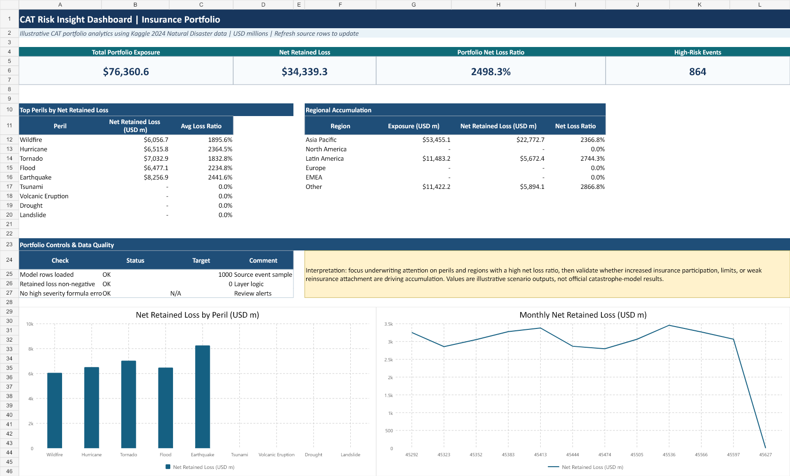
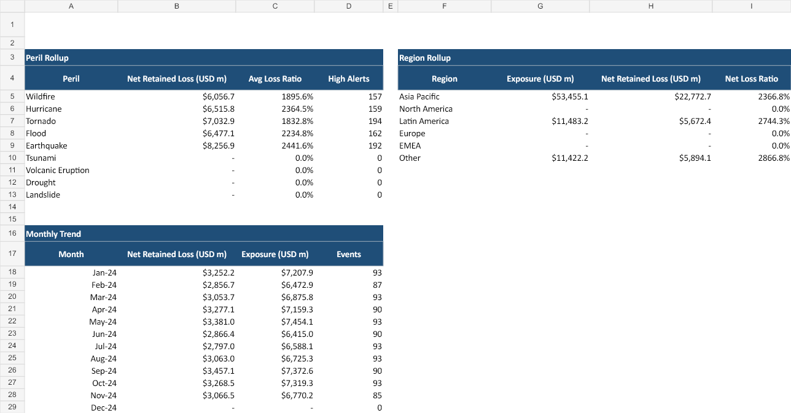
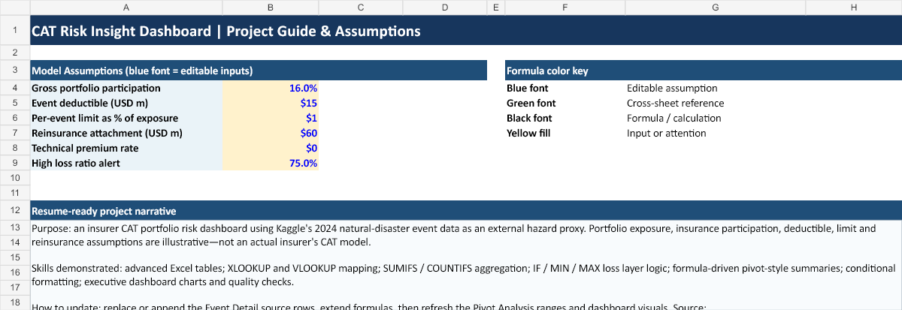

# CAT Risk Insight Dashboard

**Developed by Gaurav**

An advanced Excel project that turns catastrophe-event data into an illustrative insurance portfolio risk dashboard. The workbook is designed to demonstrate how CAT (catastrophe) exposure, insured loss, deductibles, policy limits, reinsurance, and portfolio loss ratios can be analysed in a clear business-facing format.

> Important: This is a portfolio project. The insurance-layer assumptions are illustrative and are not the output of an official catastrophe model or an insurance company.

## Project objective

Build an executive-ready Excel dashboard that helps an insurance portfolio manager answer:

- Which catastrophe perils create the largest retained losses?
- Where are the largest portfolio accumulations by region?
- Which events exceed the loss-ratio alert threshold?
- How do deductibles, policy limits, and reinsurance affect retained loss?

## Deliverable

The finished workbook is available at:

`outputs/risk-insight-dashboard/CAT_Risk_Insight_Dashboard.xlsx`

## Dashboard preview

### Pivot analysis

### Inputs and model guide

## Data source

The project uses a stratified sample from Kaggle's **Forecasting Disaster Management in 2024** dataset as an external catastrophe-hazard proxy:

https://www.kaggle.com/datasets/umeradnaan/prediction-of-disaster-management-in-2024

The source includes disaster type, location, magnitude, event date, fatalities, and economic loss. Insurance portfolio values are modelled with transparent assumptions within the workbook.

## Workbook structure

| Sheet | Purpose |
| --- | --- |
| `Dashboard` | Executive KPIs, peril and region summaries, monthly trend chart, and data-quality checks. |
| `Event Detail` | 1,000 sampled catastrophe events enriched with insurance loss-layer formulas. |
| `Pivot Analysis` | Formula-driven peril, regional, and monthly rollups used by the dashboard. |
| `Reference Tables` | Country-to-region, peril participation, capital-factor, and risk-band mappings. |
| `Inputs & Guide` | Editable model assumptions, methodology, source link, and formula colour key. |

## Excel features demonstrated

- **XLOOKUP**: maps countries to regions and perils to insured share / capital factor.
- **VLOOKUP**: maps regions to risk bands.
- **SUMIFS, COUNTIFS, and AVERAGEIFS**: generate portfolio rollups and alert counts.
- **IF, IFERROR, MIN, MAX, and ROUND**: calculate policy-layer and reinsurance loss logic.
- **Excel Table**: structures the detailed event data for review, filtering, and future refreshes.
- **Dashboard charts**: compare retained loss by peril and show the monthly retained-loss trend.
- **Conditional, audit-ready modelling**: input cells, cross-sheet references, calculations, source notes, and quality checks are visually distinguished.

## CAT loss methodology

All monetary values are displayed in USD millions.

1. Start with an event's external economic-loss proxy from Kaggle.
2. Apply country and portfolio participation assumptions to derive illustrative exposure.
3. Use the peril-specific insured share to calculate gross insured loss.
4. Apply the per-event deductible and policy limit to calculate net loss before reinsurance.
5. Apply the reinsurance attachment to calculate reinsurance recovery and net retained loss.
6. Calculate technical premium and net loss ratio; classify events as `NORMAL`, `WATCH`, or `HIGH` risk.

## Key assumptions

The workbook makes the following assumptions editable in the `Inputs & Guide` tab:

- Gross portfolio participation
- Per-event deductible
- Per-event policy limit as a percentage of exposure
- Reinsurance attachment
- Technical premium rate
- High loss-ratio alert threshold

## How to use

1. Open the workbook in Microsoft Excel.
2. Begin with the `Dashboard` tab for portfolio-level insights.
3. Change assumptions on `Inputs & Guide` to test alternative underwriting or reinsurance scenarios.
4. Filter `Event Detail` to investigate high-risk events and loss drivers.
5. Review `Pivot Analysis` for the formula-driven aggregations supporting the dashboard.

## Resume-ready description

**CAT Risk Insight Dashboard | Advanced Excel Project**  
Developed an Excel-based catastrophe-risk dashboard using Kaggle natural-disaster data, integrating XLOOKUP/VLOOKUP, SUMIFS, COUNTIFS, insurance loss-layer calculations, reinsurance scenarios, portfolio risk metrics, and executive visualisations to identify concentration and retained-loss drivers.

## Future enhancements

- Add native PivotTables and slicers for Peril, Region, and Risk Band.
- Add PML / exceedance-probability metrics, including 1-in-100 and 1-in-250 return periods.
- Add Base, Stress, and Severe scenario controls.
- Refresh the model with insurer-specific exposure, policy, treaty, and vendor catastrophe-model outputs when available.

---

Developed by **Gaurav**.
